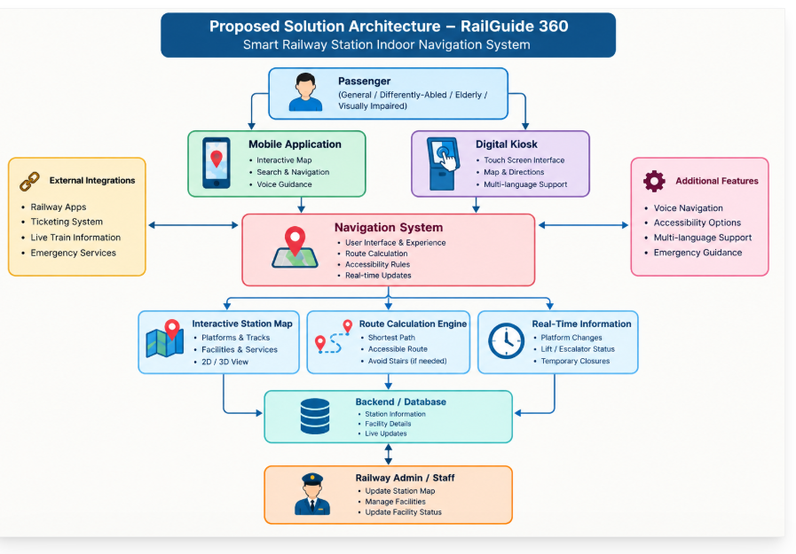
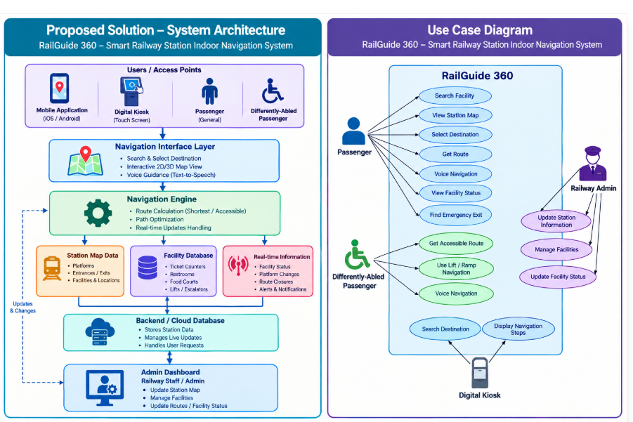

# RailGuide 360

### Smart Railway Station Indoor Navigation System

**SIH Problem Statement 1710 – Enhancing Navigation for Railway Station Facilities and Locations**

## 📌 Problem Overview

Large railway stations contain many facilities such as platforms, ticket counters, restrooms, waiting areas, food courts, lifts and escalators. Passengers who are unfamiliar with a station may find it difficult to locate these facilities quickly.

RailGuide 360 is proposed to provide simple and accessible indoor navigation within railway stations.

## 💡 Proposed Solution

RailGuide 360 is a multi-platform navigation system that helps passengers search for railway station facilities and reach their destinations using step-by-step directions.

The system provides interactive station maps, route calculation, accessibility-friendly navigation, voice guidance and real-time information about facilities and routes.

Passengers can access the system through a mobile application or digital kiosk.

## 🎯 Objectives

* Help passengers find station facilities easily.
* Provide step-by-step indoor navigation.
* Reduce confusion and unnecessary walking.
* Support wheelchair-friendly routes.
* Provide voice guidance for visually impaired passengers.
* Display real-time facility and route updates.
* Provide railway staff with tools to update station information.

## ⭐ Key Features

### 1. Interactive Station Map

Displays platforms, entrances, exits and important station facilities.

### 2. Smart Route Navigation

Calculates a suitable route between the passenger's location and selected destination.

### 3. Accessibility Mode

Provides routes using lifts and ramps and can avoid stairs when required.

### 4. Voice Guidance

Provides spoken navigation instructions for visually impaired passengers.

### 5. Real-Time Updates

Displays important changes such as platform changes, facility status and temporary route closures.

### 6. Digital Kiosk

Touch-screen kiosks allow passengers to search for destinations inside the station.

### 7. Emergency Navigation

Helps passengers locate emergency exits, medical facilities and help desks.

### 8. Admin Dashboard

Railway staff can update station maps, facilities, routes and facility status.

## 🏗️ Proposed Solution Architecture

The system consists of passenger access points, a navigation interface, navigation engine, station map data, facility database, real-time information, backend database and an admin dashboard.

## 👥 Use Case Diagram

The use case diagram represents the interactions between passengers, differently-abled passengers, railway administrators and the digital kiosk.

## 🔄 System Workflow

1. Passenger opens the RailGuide 360 application or uses a digital kiosk.
2. The passenger selects the railway station and current location.
3. The passenger searches for a destination or facility.
4. The system identifies the required route.
5. The navigation engine calculates a suitable route.
6. Accessibility preferences are considered when required.
7. Step-by-step directions are displayed.
8. Voice guidance can provide spoken instructions.
9. Real-time changes are used to update the route.
10. The passenger reaches the selected destination.

## ♿ Accessibility

RailGuide 360 is designed to support different passenger requirements.

* Wheelchair-friendly routes.
* Lift and ramp navigation.
* Avoidance of stairs when required.
* Voice-based guidance.
* Clear visual directions.
* Emergency facility navigation.

## 🛠️ Proposed Technology Stack

**Frontend**

* React Native
* HTML
* CSS
* JavaScript

**Backend**

* Node.js
* Express.js

**Database**

* Firebase / MongoDB

**Navigation**

* Indoor digital maps
* Graph-based route calculation

**Accessibility**

* Text-to-Speech
* Voice guidance

**Development Tools**

* Visual Studio Code
* Git
* GitHub

## 🚀 Future Scope

* 3D indoor station navigation.
* Augmented Reality-based directions.
* Multilingual voice assistance.
* AI-based crowd-aware route selection.
* Integration with railway applications.
* Integration with IoT-based station sensors.
* Automatic detection of temporary route changes.

## ✅ Expected Benefits

* Saves passenger time.
* Reduces confusion inside large stations.
* Makes facilities easier to locate.
* Improves accessibility.
* Supports visually impaired and wheelchair users.
* Helps passengers respond to station changes.
* Can reduce unnecessary movement and congestion.

## 📚 References

* Smart India Hackathon – Problem Statement 1710
* Ministry of Railways
* Official railway passenger information resources
* Documentation of the technologies proposed for the system

## 👩‍💻 Project

**Project:** RailGuide 360
**Problem Statement:** SIH 1710
**Domain:** Railway / Smart Navigation

